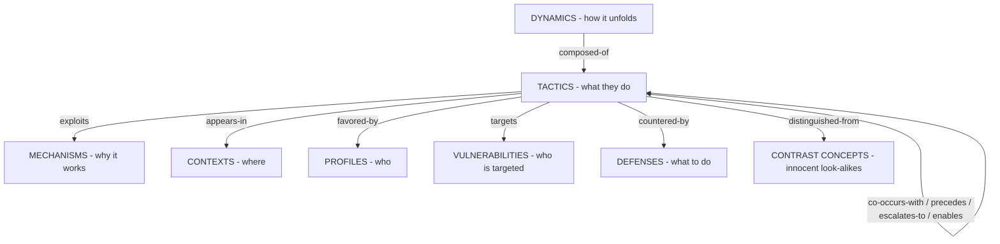

# Master Taxonomy

> The map of the knowledge base: seven entity types answering seven questions, twelve typed relations connecting them, and a crosswalk showing how every major published taxonomy of manipulation folds into this structure.

## The seven questions

Manipulation can't be researched as one topic, but it decomposes cleanly along orthogonal axes — the same move ([[guilt-tripping]]) can appear in any arena, pull several psychological levers, and belong to many longer arcs. So the KB separates:

| Type | Question | Folder | Examples |
|---|---|---|---|
| **mechanism** | *Why does it work?* — the psychological lever | `mechanisms/` | [[reciprocity]], [[intermittent-reinforcement]], [[memory-fallibility]] |
| **tactic** | *What do they do?* — the observable move | `tactics/` | [[gaslighting]], [[lowballing]], [[love-bombing]] |
| **dynamic** | *How does it unfold over time?* — the multi-tactic arc | `dynamics/` | [[abuse-cycle]], [[con-anatomy]], [[cult-conversion-funnel]] |
| **context** | *Where does it happen?* — the arena and its incentives | `contexts/` | [[workplace-bosses]], [[sales]], [[propaganda-politics]] |
| **profile** | *Who does it?* — actor patterns | `profiles/` | [[dark-triad-overview]], [[everyday-manipulators]] |
| **vulnerability** | *Who's targeted — why them, why now?* | `vulnerabilities/` | [[crisis-windows]], [[people-pleasing-fawn]] |
| **defense** | *What do I do about it?* | `defenses/` | [[detection-heuristics]], [[gray-rock]], [[documentation-practices]] |

Plus `meta/` for the epistemic frame ([[manipulation-vs-influence]], [[epistemic-guardrails]]) — the files that keep the rest honest.

## How the types connect

Twelve typed relations make connections queryable rather than implied: `exploits`, `appears-in` (declared via the `domains:` frontmatter key), `co-occurs-with` (correlation), `precedes` / `escalates-to` / `enables` (sequence & causation), `countered-by`, `distinguished-from` (disambiguation — the caveat made structural), `variant-of`, `favored-by`, `targets`, `composed-of`. Authoring rules and the full semantics table live in `CLAUDE.md`; `tools/kb.py` compiles the graph into `graph/edges.yaml`, with human-readable views in `graph/tactic-mechanism.md` and `graph/tactic-context.md`.

**Reading the relations:** *correlations* are `co-occurs-with` edges (tactics that travel together); *causation* claims are `precedes`/`escalates-to`/`enables` edges (graded by each file's evidence); *caveats* are `distinguished-from` edges plus every file's mandatory Caveats section.

## The severity overlay

Every type is crossed by an intensity gradient — the same lever scales from nuisance to crime:

| Band | Character | Example trajectory |
|---|---|---|
| Everyday friction | Situational, low-stakes, often unconscious | a guilt-trippy request; a pushy upsell |
| Systematic exploitation | Patterned, asymmetric benefit, concealment | [[mlm-recruitment-scripts]], chronic [[weaponized-incompetence]] |
| Abuse / capture | Control structure over a person's life | [[coercive-control]], [[cult-conversion-funnel]] |
| Crime | Crosses legal thresholds (see [[manipulation-vs-influence]]) | fraud, [[con-anatomy]], s.76 coercive control |

Files carry a `severity:` field for typical harm potential, but **band is determined by pattern and structure, not by which tactic appears** — guilt-tripping exists in all four bands. This is the structural reason [[epistemic-guardrails]] forbids inferring band from a single observed move.

## Crosswalk: prior taxonomies and where they fold in

Every well-known framework is a partial map — mechanism-level, tactic-level, or domain-bound. Verified categories below; this KB's contribution is connecting the layers they each capture alone.

| Framework | Scope | Categories (verified) | Folds into |
|---|---|---|---|
| Cialdini's principles (2016/2021) [1] | mechanisms | reciprocity, commitment/consistency, social proof, authority, liking, scarcity, **unity** (7th, added in *Pre-Suasion*) | one mechanism file each |
| Buss et al. (1987; 1992) [2] | tactics, close relationships | charm, silent treatment, coercion, reason, regression, **debasement**; 1992 adds responsibility invocation, reciprocity, monetary reward, pleasure induction, social comparison, hardball | core tactics tier; the empirical anchor for everyday manipulation |
| Marwell & Schmitt (1967); Kellermann & Cole (1994) [3] | compliance-gaining | 16 techniques (promise, threat, pre-giving, debt, moral appeal, altercasting…); later consolidated to 64 strategies from 74 schemes | mechanisms + tactics; reminder that influence lists are morally neutral ([[manipulation-vs-influence]]) |
| Kipnis et al. (1980) [4] | workplace influence | assertiveness, ingratiation, rationality, sanctions, exchange, upward appeals, blocking, coalitions | [[workplace-bosses]] dossier |
| Simon, *In Sheep's Clothing* (1996/2010) [5] | covert aggression | ~18 tactics (count varies by edition): minimization, lying, denial, selective inattention, rationalization, diversion, evasion, covert intimidation, guilt-tripping, shaming, playing victim, vilifying the victim, servant role, seduction, projecting blame, feigning innocence/confusion, brandishing anger | core tactics tier (several files; clinical grade) |
| IPA propaganda devices (1937) [6] | propaganda | name calling, glittering generalities, transfer, testimonial, plain folks, card stacking, band wagon | [[propaganda-devices]] |
| Lifton's totalism criteria (1961) [7] | thought reform | milieu control, mystical manipulation, demand for purity, cult of confession, sacred science, loading the language, doctrine over person, dispensing of existence | [[cults-high-control]], [[cult-conversion-funnel]], [[thought-terminating-cliches]] |
| Hassan's BITE model [8] | cult control | Behavior, Information, Thought, Emotional control | [[cults-high-control]] (with critique noted below) |
| Duluth Power & Control Wheel (1984) [9] | intimate-partner abuse | 8 spokes — intimidation; emotional abuse; isolation; minimizing/denying/blaming; using children; male privilege; economic abuse; coercion & threats — inside a rim of physical/sexual violence | [[intimate-relationships]], [[coercive-control]] (with critique noted below) |
| McCornack's IMT (1992) [10] | deception | covert violation of Grice's maxims: quantity, quality, relation, manner | [[lying-typologies]] |
| Buller & Burgoon's IDT (1996) [11] | deception | falsification, concealment, equivocation | [[lying-typologies]] |
| Whaley (1982) [12] | strategic deception | dissimulation (masking, repackaging, dazzling) × simulation (mimicking, inventing, decoying) | [[lying-typologies]], [[disinformation-playbooks]] |
| Mathur et al. (2019); Gray et al. (2018); Brignull [13] | dark patterns | Mathur: sneaking, urgency, misdirection, social proof, scarcity, obstruction, forced action; Gray: nagging, obstruction, sneaking, interface interference, forced action; Brignull: 16 named types | [[dark-patterns-obstruction]], [[dark-patterns-social-urgency]] |
| Krombholz et al. (2015); Mitnick [14] | social engineering | channel × operator × type taxonomy; Mitnick's cycle: research → rapport/trust → exploit trust → utilize | [[phishing-pretexting]] |
| Stajano & Wilson (2011) [15] | scam principles | distraction, social compliance, herd, dishonesty, kindness, need & greed, time | [[scams-fraud]], [[con-anatomy]] |
| OFT *Psychology of Scams* (2009) [16] | scam compliance | authority/legitimacy cues, visceral triggers, scarcity/urgency, disproportionate reward | [[scams-fraud]] mechanisms map |
| Pratkanis (2007) [17] | social influence | 107 experimentally tested influence tactics | standing cross-check at synthesis checkpoints |
| Faden & Beauchamp (1986) [18] | influence ethics | persuasion → manipulation → coercion continuum | [[manipulation-vs-influence]] |
| Undue-influence factors (Cal. WIC §15610.70) [19] | legal | vulnerability, apparent authority, tactics, inequity of result | [[manipulation-vs-influence]], [[elder-targeting]] |

## Design choices

1. **Mechanism/tactic/dynamic separation.** Frameworks above conflate levels (Cialdini = mechanisms; Simon = tactics; Lifton = a context-bound dynamic). Separating them lets one mechanism explain many tactics, and one tactic serve many dynamics — and lets a defense generalize ("this is [[scarcity-urgency]] again, in timeshare clothing").
2. **Defenses and caveats are entities, not afterthoughts.** `countered-by` and `distinguished-from` are first-class edges because the KB exists for defense and must not over-detect ([[epistemic-guardrails]]).
3. **Folk vocabulary is kept, graded.** Users search "hoovering" and "flying monkeys"; files keep those names and grade the evidence honestly (`folk`/`clinical`) instead of pretending the terms don't exist or that they're science.
4. **Stable ids + typed edges** make the KB equally navigable by humans (Obsidian graph/backlinks) and machines (`graph/edges.yaml`, frontmatter grep).

## Navigation entry points

- **"Something feels off after every conversation"** → start at the [[felt-sense-index]] (feeling → candidate patterns), then [[gaslighting]], [[circular-conversation]], [[double-binds]]
- **"I'm being pressured to decide fast"** → [[manufactured-urgency]], [[scarcity-urgency]], [[verification-rituals]]
- **"This group/job/partner seems too good, too fast"** → [[love-bombing]], [[mirroring-false-identity]], [[cult-conversion-funnel]], [[boundary-testing]]
- **"Is this deal/opportunity real?"** → [[hope-greed]], [[con-anatomy]], [[detection-heuristics]]
- **"Is this person dangerous or just difficult?"** → [[epistemic-guardrails]] first, then [[everyday-manipulators]] vs [[coercive-control]]
- **"How do I get out?"** → [[no-contact-exit-planning]], [[dv-safety-planning]], [[cult-exit-support]]
- **Browsing** → context dossiers (`contexts/`) are the widest doors; the graph view shows the rest.

## Caveats

- **Categories blur at the edges.** Tactics are fractal (gaslighting contains lying; coercive control contains nearly everything). The `composed-of` edge expresses containment without pretending categories are crisp; `variant-of` is defined in the schema but currently carries no edges — the KB expresses tactic specialization through separate files plus `distinguished-from`/`co-occurs-with` rather than a strict subtype hierarchy.
- **A taxonomy is a tool, not a truth.** Kellermann & Cole's verdict on 74 prior influence taxonomies — overlapping, atheoretical, non-equivalent [3] — is a warning label for this one too. The crosswalk keeps this KB falsifiable against the literatures it synthesizes.
- **The crosswalk is WEIRD-heavy.** Nearly every framework above is US/Western in origin and sample. Cross-cultural validity varies by layer — core mechanisms like [[reciprocity]] appear near-universal; specific tactics, norms, and thresholds shift across cultures (*cultural difference*). Domain files flag cultural scope where it bites.
- **Framework critiques carry into their files.** BITE/thought-reform models have academic critics (and the APA's 1987 DIMPAC memo declined to endorse brainwashing theory) [8]; the Duluth model is criticized for gender asymmetry and weak intervention-outcome evidence [9]; IDT was famously challenged on explanatory grounds [11]. Domain files inherit these debates in their Evidence sections.

## Sources

1. Cialdini, R. *Pre-Suasion* (2016); *Influence: New and Expanded* (2021) — unity as 7th principle.
2. Buss, D. M., et al. (1987). *JPSP* 52(6), 1219–1229; Buss (1992). *Journal of Personality* 60(2), 477–499.
3. Marwell, G., & Schmitt, D. (1967). *Sociometry* 30(4), 350–364; Kellermann, K., & Cole, T. (1994). *Communication Theory* 4(1), 3–60.
4. Kipnis, D., Schmidt, S., & Wilkinson, I. (1980). *J. Applied Psychology* 65(4), 440–452.
5. Simon, G. K. (1996/2010). *In Sheep's Clothing.* Parkhurst Brothers.
6. Institute for Propaganda Analysis (1937). "How to Detect Propaganda." *Propaganda Analysis* 1(2).
7. Lifton, R. J. (1961). *Thought Reform and the Psychology of Totalism*, ch. 22.
8. Hassan, S. *Combating Cult Mind Control* (1988; BITE formalized 2000+). freedomofmind.com; critique: Introvigne/CESNUR (partisan source, noted), APA DIMPAC memo (1987).
9. Domestic Abuse Intervention Programs (1984). Power & Control Wheel. theduluthmodel.org; critique: Dutton & Corvo (2007). *Aggression and Violent Behavior*.
10. McCornack, S. (1992). *Communication Monographs* 59(1), 1–16; IMT2: McCornack et al. (2014). *J. Language and Social Psychology* 33(4).
11. Buller, D., & Burgoon, J. (1996). *Communication Theory* 6(3), 203–242; critique: DePaulo, Ansfield & Bell (1996), same issue.
12. Whaley, B. (1982). *J. Strategic Studies* 5(1), 178–192.
13. Mathur, A., et al. (2019). *Proc. ACM HCI* 3(CSCW), art. 81; Gray, C., et al. (2018). CHI '18; Brignull, H. deceptive.design/types (16 types); consolidation: Gray et al. (2024). CHI '24 ontology.
14. Krombholz, K., et al. (2015). *J. Information Security and Applications* 22, 113–122; Mitnick, K., & Simon, W. (2002). *The Art of Deception.*
15. Stajano, F., & Wilson, P. (2011). *Communications of the ACM* 54(3), 70–75.
16. Fischer, Lea & Evans (2009). *The Psychology of Scams.* UK OFT report 1070.
17. Pratkanis, A. (2007). "Social Influence Analysis: An Index of Tactics." In *The Science of Social Influence.* Psychology Press, 17–82.
18. Faden, R., & Beauchamp, T. (1986). *A History and Theory of Informed Consent.* OUP.
19. Cal. Welf. & Inst. Code §15610.70.

## See also

[[manipulation-vs-influence]] · [[epistemic-guardrails]] · `ROADMAP.md` (coverage plan) · `CLAUDE.md` (schema & query cookbook) · `graph/edges.yaml` (compiled connections)
